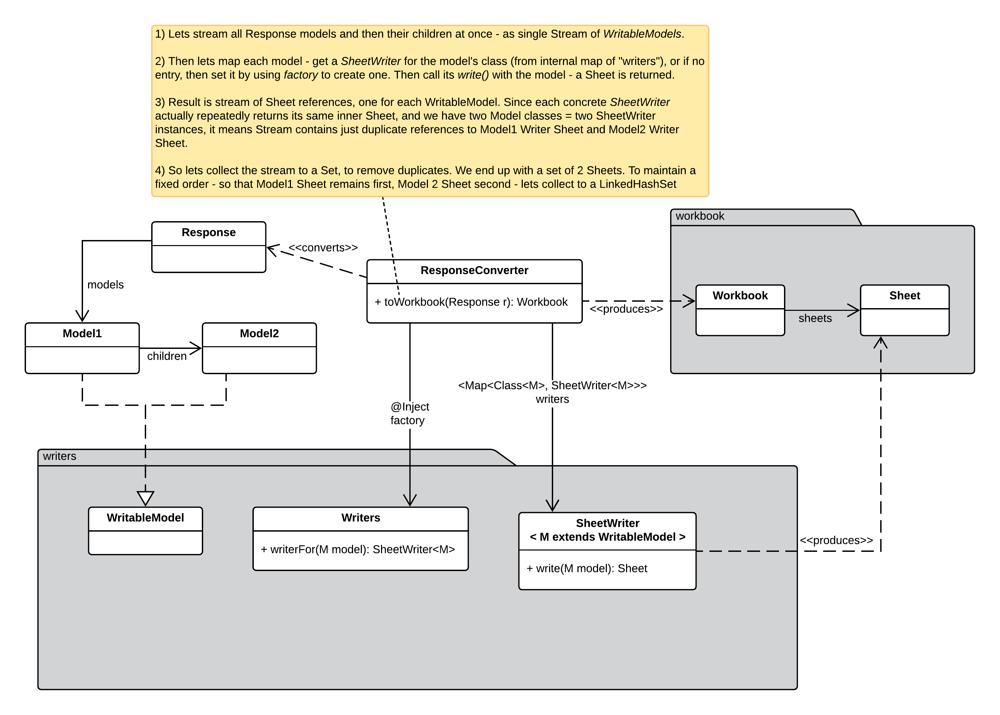
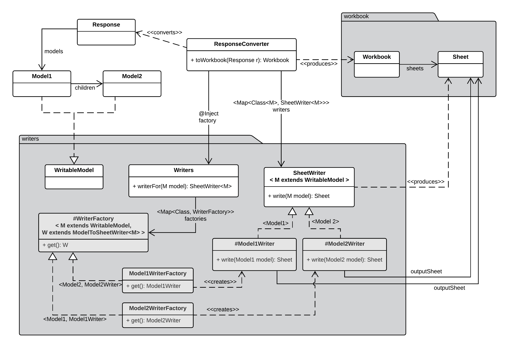

## Design Patterns exercise - Factory of Strategies

### Requirements

* A `Response` data object (DTO) holds a list of `Model1` data objects. Eg, the *Response models*.
  These models have some arbitrary fields of information that we will need.
* Each `Model1` data object (DTO) in turn may hold a list of `Model2` data objects. Eg the *children*.
  These child models in turn as well have some other fields of information that we will need.
* All the information contained in the entire `Response` needs to be converted (written) to
  an Excel-like `Workbook` which has 2 `Sheets`
* First result `Sheet` must contain all the information about data in `Model1` objects. 
  Eg, for each `Model1` object, the sheet must have exactly one row containing is information.
* Second result `Sheet` must contain all the information about data in `Model2` objects
  Eg, again for each `Model2` object, the sheet must have exactly one row containing its information.

* The goal of the exercise is to find a good pattern-oriented design and implement it - 
  in a way that logic of filling (writing) the different sheets based on different types
  of data models would be distinct and separate - and in a way that the main `Response` 
  conversion logic would not need to know anything about the particular concrete logic.
  
* This means - the main conversion logic does not branch explicitly based on type of data models,
  nor instanciate different classes of logic itself, nor contain the actual filling (writing) logic
  itself. Instead, it uses polymorphic Factories and a Strategy pattern implementation to get the
  conversion done at high level "transparently", unaware of the details of how its actually done.
  
### External view of design (Writers usage from outside)

### Implementation view of design (Writers mechanism under the hood)

